# 
University OOP PROJECT
 

###  
Used 4 OOP Basic Principle

 
Encapsulation-Inheritance-Polymorphism-Abstraction
 

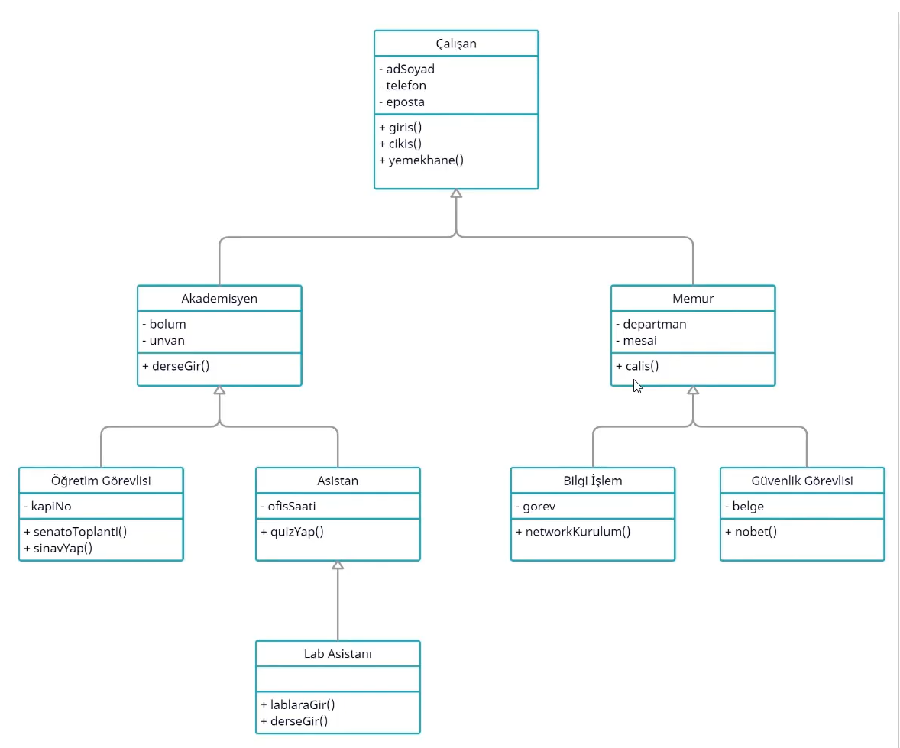

## Encapsulation
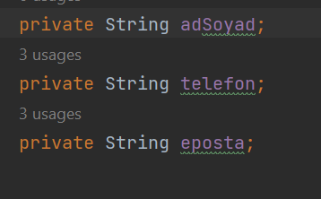 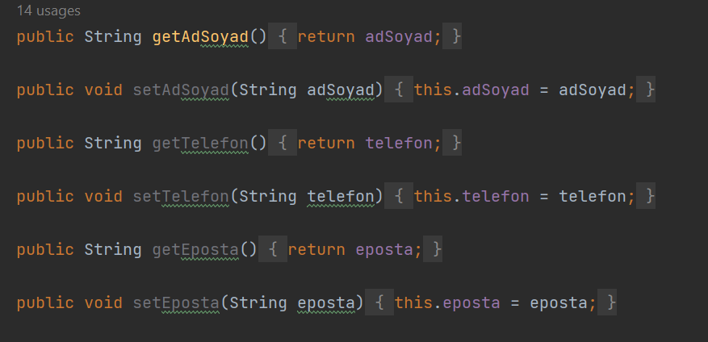
## Inheritance 
We use main class metot to other baby class..

Baby class extends Main class

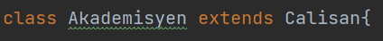
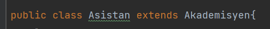
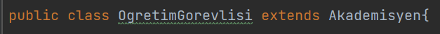
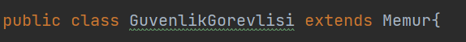
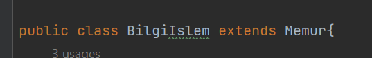
## Polymorphism
=> Create other class constrc metot with obj class
    
    Akademisyen rektör = new Ogretimgörevlisi();
    Akademisyen ogretimgorevlisi = new Ogretimgörevlisi();
    Memur bilgiislemci = new BilgiIslem();
#### Input;
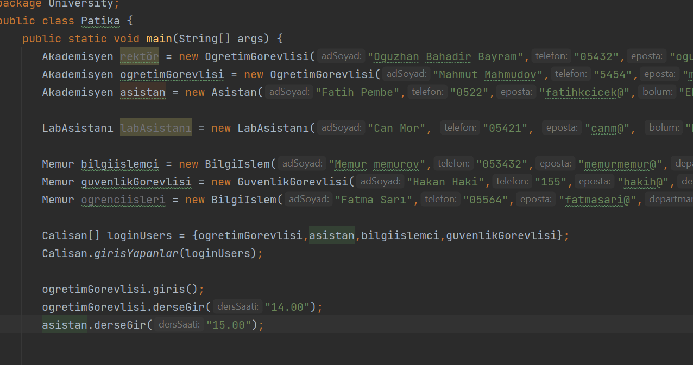 
#### Output;

## Abstraction

We can abstrac main class but some problems arise in IDE, we must abstrac baby class and make override metot.

#### Main Abstrac Class..
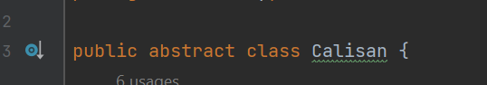 

#### Baby Class..
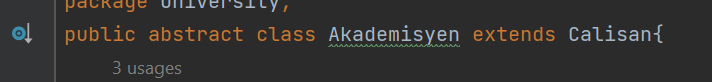 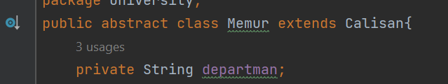

#### Override Metot..

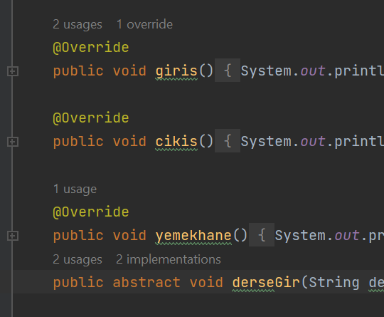 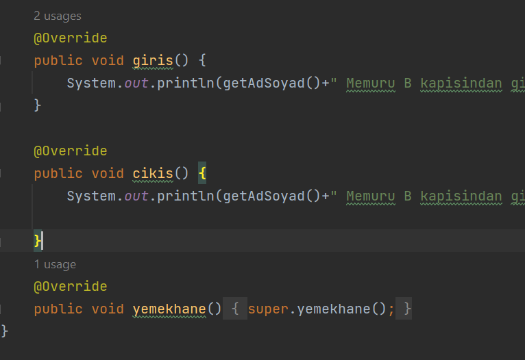